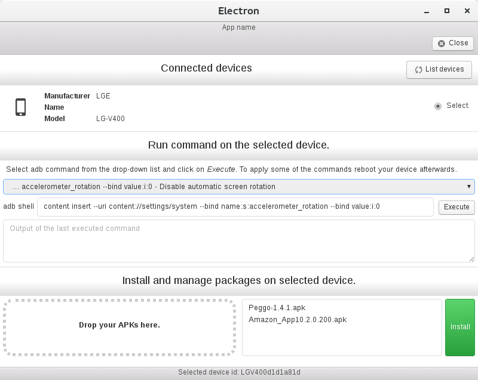

# Android-Adb-Tweaker

A Electron application using the node implementation of the client for the Android Debug Bridge server to manage your Android device.
Still WIP, allows runing commands through _adb shell_ and installation of multiple ADB packages at the moment.

Written in [Electron](https://electron.atom.io/) and [React](https://facebook.github.io/react/)

#### License [CC0 1.0 (Public Domain)](LICENSE.md)
