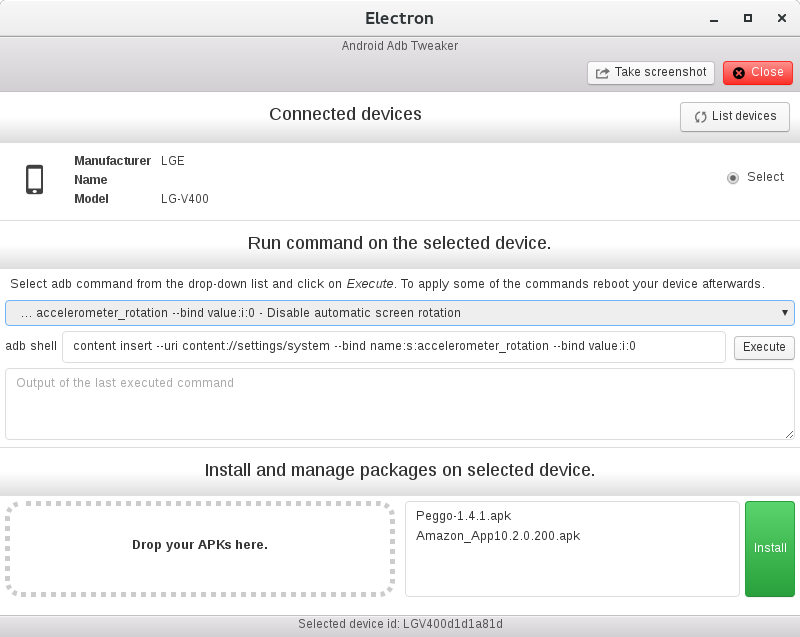

# Android-Adb-Tweaker

A Electron application using the [Node.js implementation of the client][1] for the Android Debug Bridge server to manage your Android device.
## Still WIP, following features wre implemented:
+ listing connected devices
+ runing commands through _adb shell_
+ installation of multiple ADB packages
+ screenshot capturing

## TODO
+ packaging, release
+ aplication icon
+ code cleanup
+ tests
+ more features:
  + view filesystem on device
  + copy files from device
  + copy files to device
  + support for rooted devices
  + ...

Written in [Electron](https://electron.atom.io/) and [React](https://facebook.github.io/react/)

[1]: https://github.com/openstf/adbkit

#### License [CC0 1.0 (Public Domain)](LICENSE.md)